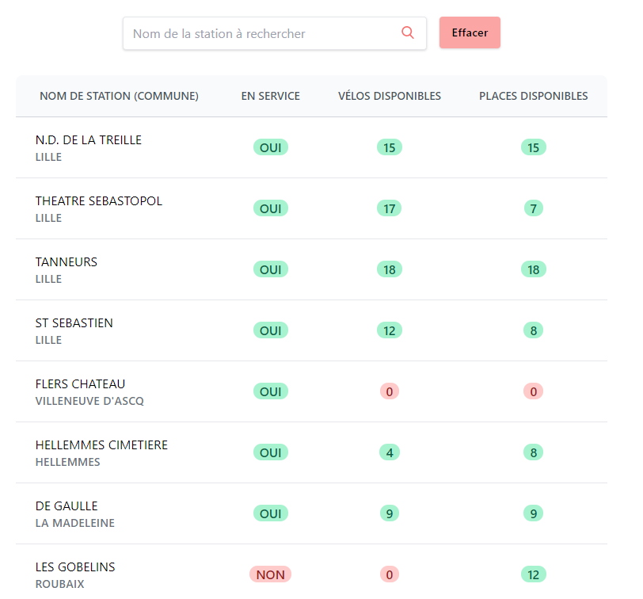
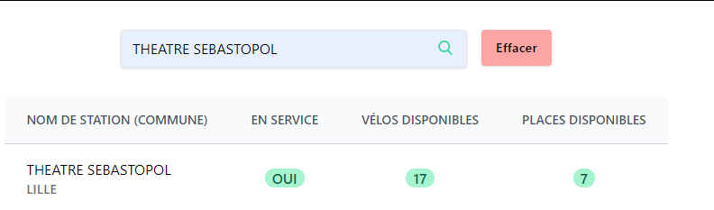
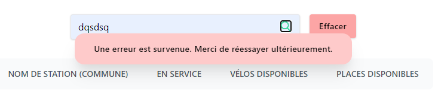

# TP V'lille

Objectif du TP :
Réalisation d’une application permettant d’obtenir les informations du service V’Lille

Screenshot de l'application web:

Home:

Filter:

Error lorsque le network n'est pas disponible:

